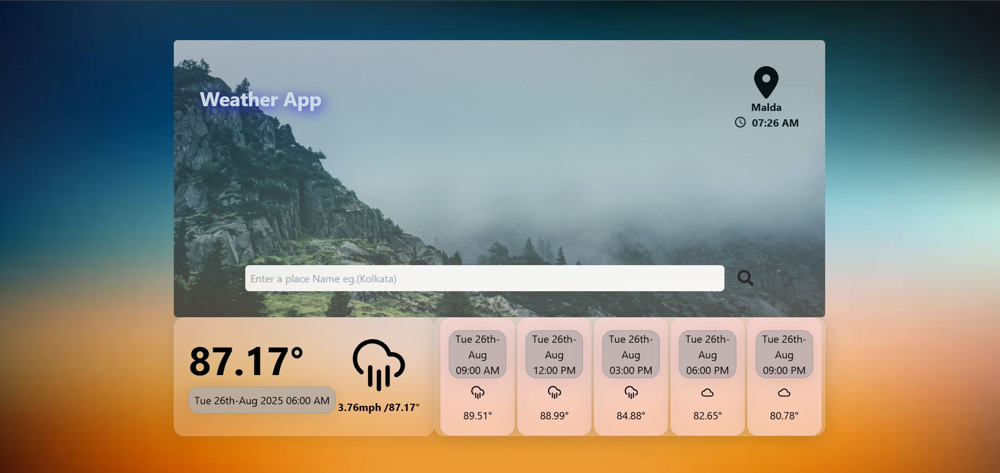

# ⛅ Weather Forecast Web App  

<p align="center">
  
</p>

## 📌 About the Project
The **Weather Forecast Web App** is a responsive application built with **React.js** and **Node.js**, powered by the **OpenWeatherMap API**.  

It provides users with **real-time weather updates and forecasts** for their **current location**, including the **time and weather conditions**.  
Users can also search for forecasts of **any location worldwide**.  

Designed with a **mobile-first approach**, the app uses **Tailwind CSS** for a clean, modern, and efficient UI.  

---

## ✨ Features
- 🌍 Get **real-time weather updates** for your current location  
- 🔍 Search weather forecasts for **any global location**  
- ⏰ Displays current time and weather conditions  
- 📱 **Mobile-first design** with responsive UI  
- 🎨 Built with **Tailwind CSS** for sleek and modern styling  

---

## 🛠️ Tech Stack
- **Frontend:** React.js, Tailwind CSS   
- **API Integration:** [OpenWeatherMap API](https://openweathermap.org/api)  

---

## 🚀 Getting Started

### Prerequisites
Ensure you have installed:
- [Node.js](https://nodejs.org/) (v14+ recommended)  
- npm or yarn  

### Installation
```bash
# Clone the repository
git clone https://github.com/JoySarkar07/Weather_app.git

# Navigate to the project folder
cd Weather_app

# Install dependencies
npm install
```
# Start development server
```bash
npm run dev
```